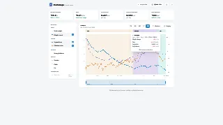

# Macroscope · Trends Viewer

An interactive dashboard for exploring nutrition-tracking exports (MacroFactor `.xlsx` files): trend lines, brushable date ranges, and configurable markers, built with vanilla JS + React (in-browser Babel) and uPlot for charting.

**[Live demo](https://j-snowden.github.io/macrofactor-dashboard/)**



## Features

- Upload your own `.xlsx` export or explore with bundled sample data
- Brushable/zoomable trend charts (uPlot)
- Custom markers and annotations
- Light/dark theme toggle

## Running locally

No build step — just serve the folder statically:

```
npx serve .
```
